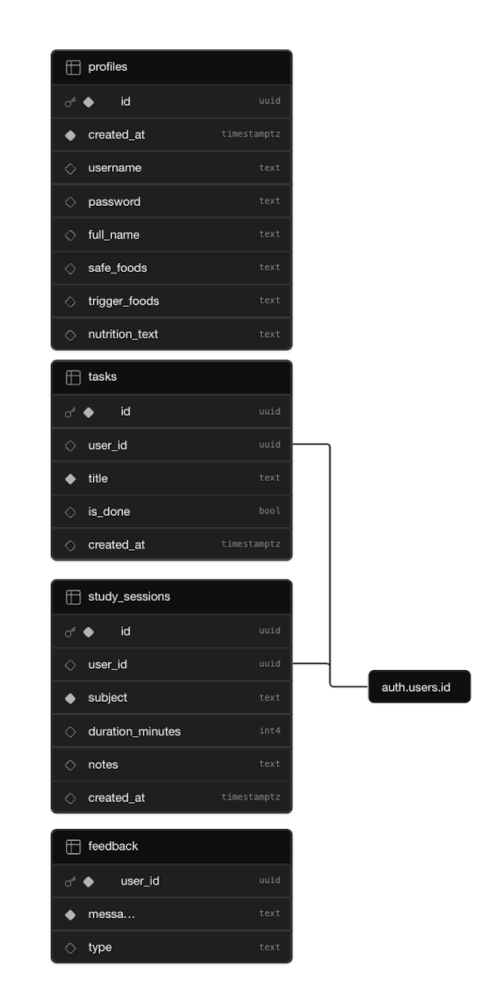
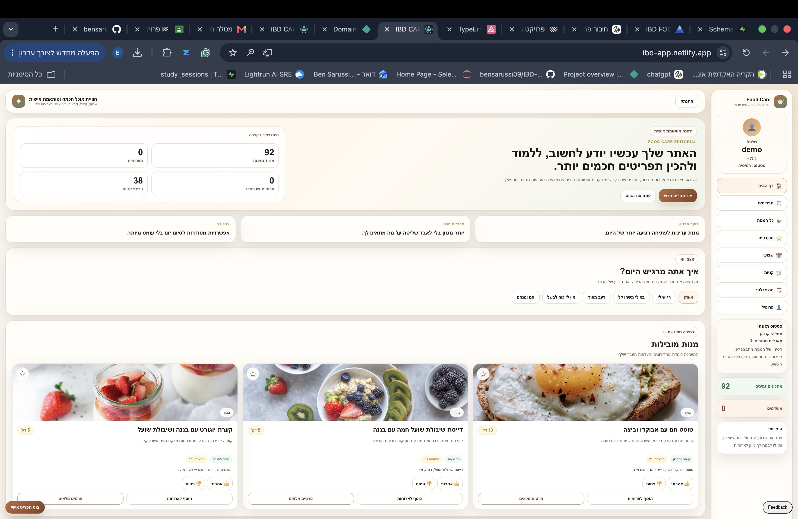
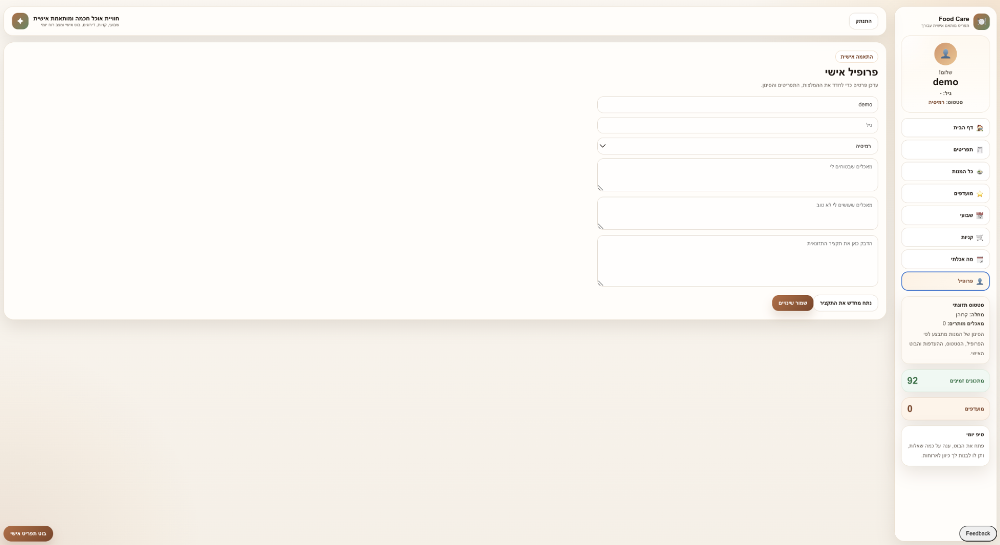
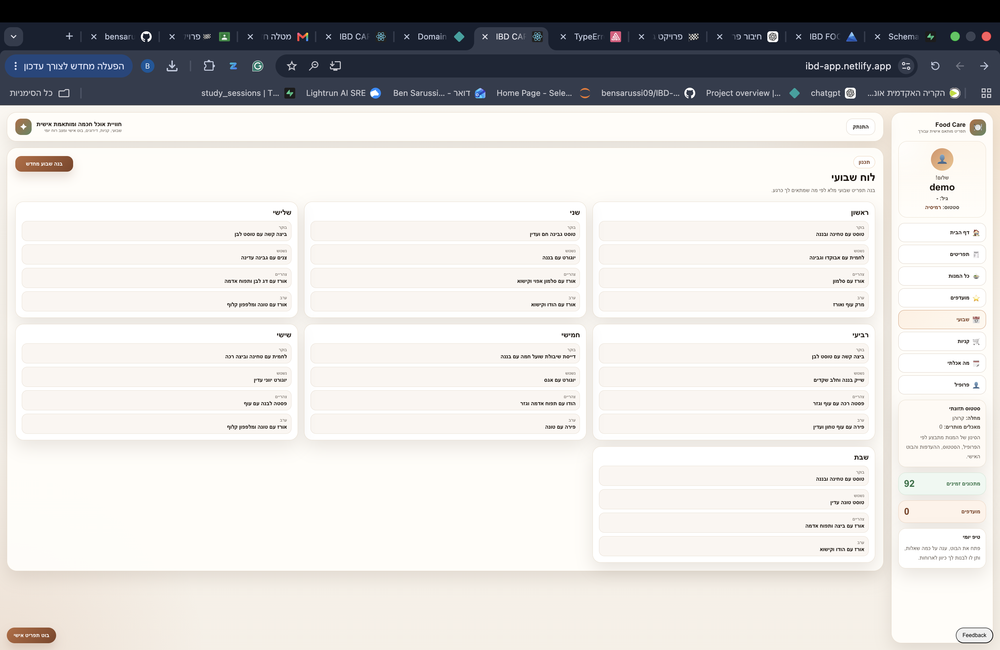

# IBD FOOD CARE

## Personalized Nutrition Management Platform for Crohn's Disease and IBD Patients

Developed using React, Supabase and Netlify.

---

## Project Overview

IBD FOOD CARE is a personalized nutrition management system designed for people living with Crohn's Disease and other Inflammatory Bowel Diseases (IBD).

Many IBD patients struggle to identify which foods are safe for them, which foods trigger symptoms, and how to maintain a balanced diet during different stages of their condition.

This application provides a centralized platform that helps users:

- Maintain a personal nutrition profile
- Record safe and trigger foods
- Receive personalized meal suggestions
- Browse IBD-friendly recipes
- Build weekly meal plans
- Manage shopping lists
- Track daily well-being
- Organize learning sessions and personal tasks
- Submit feedback for future improvements

The project combines nutritional knowledge, personalization, and modern web technologies into a single user-friendly platform.

---

## Live Demo

### Production Website

https://ibd-app.netlify.app

### Demo Account

- Username: demo
- Password: 123456

---

## Quick Access for Testing

To simplify project evaluation, a demo account was created.

The account already contains:

- Personal nutrition profile
- Safe foods
- Trigger foods
- Personalized recommendations
- Weekly meal plan examples

This allows the evaluator to immediately explore all major system features without creating a new account.

---

## Problem Statement

People suffering from Crohn's Disease and other IBD conditions often experience significant differences in food tolerance.

A food that is completely safe for one patient may trigger symptoms for another.

Most nutrition websites provide general recommendations but do not offer personalized guidance based on individual food tolerances and nutritional history.

The goal of this project was to build a personalized nutrition management platform that adapts to the user's profile and dietary needs.

---

## Solution

IBD FOOD CARE allows users to create a personalized nutrition profile containing:

- Disease type
- Safe foods
- Trigger foods
- Personal nutrition notes

The system uses this information together with nutritionist-approved recommendations and internal recommendation logic to generate personalized meal suggestions and weekly meal plans.

---

## Main Features

### User Authentication

- User registration
- User login
- Secure authentication using Supabase Auth

### Personal Nutrition Profile

Users can manage:

- Full name
- Disease type
- Safe foods
- Trigger foods
- Personalized nutrition notes

### Recipe Library

The application contains a large collection of IBD-friendly recipes.

Each recipe includes:

- Ingredients
- Description
- Preparation time
- Safety level
- Meal category

### Personalized Meal Recommendations

The recommendation system analyzes:

- Safe foods
- Trigger foods
- User preferences
- Nutrition notes

and suggests meals that better fit the user's profile.

### Weekly Meal Planner

Users can automatically generate a complete weekly meal plan including:

- Breakfast
- Lunch
- Dinner

for every day of the week.

### Favorites System

Users can save preferred recipes for future use.

### Shopping List

Users can generate and manage shopping lists based on selected meals and recipes.

### Daily Feeling Tracker

Users can report their daily condition and well-being.

This information can later support future nutrition decisions and recommendations.

### Study Session Tracker

Users can track learning activities and study sessions including:

- Subject
- Duration
- Notes

### Task Manager

Users can create and manage personal tasks.

### Feedback System

Users can submit:

- Suggestions
- Feature requests
- General feedback

Feedback is stored in the database for future product improvements.

---

## AI-Inspired Nutrition Logic

The project includes an AI-inspired recommendation engine.

Instead of relying on an external AI API, the system uses personalized nutrition data and rule-based recommendation logic.

The recommendation process considers:

- Safe foods
- Trigger foods
- Nutrition notes
- User preferences

to generate more personalized meal suggestions.

---

## Nutrition Knowledge Source

The nutritional recommendation logic was built using dietary guidance provided by a clinical nutrition specialist experienced in treating patients with Crohn's Disease and IBD.

The nutritionist supplied professional recommendations regarding:

- Safe foods during remission
- Foods that may trigger symptoms
- Meal structure recommendations
- General nutritional guidelines

This professional knowledge was adapted into the application's recommendation engine and personalized meal planning logic.

---

## System Architecture

### Frontend

- React
- JavaScript
- CSS

### Backend

- Supabase Authentication
- Supabase Database

### Deployment

- Netlify

### Version Control

- GitHub

---

## Database Design ERD

### ERD Diagram

---

## Main Tables

### profiles

Stores user profile information.

Fields:

- id
- username
- full_name
- safe_foods
- trigger_foods
- nutrition_text

Authentication is handled by Supabase Auth.

### tasks

Stores personal tasks.

Fields:

- id
- user_id
- title
- is_done
- created_at

### study_sessions

Stores learning and study records.

Fields:

- id
- user_id
- subject
- duration_minutes
- notes
- created_at

### feedback

Stores user feedback submissions.

Fields:

- user_id
- message
- type

---

## Application Screenshots

### Home Dashboard

### User Profile

### Weekly Meal Planner

---

## Testing Instructions

To test the application:

- Open the live application
- Login using the demo account
- Navigate to the Profile page
- Review safe foods and trigger foods
- Browse personalized meal recommendations
- Open the Weekly Planner
- Create a task
- Submit feedback

All major project features can be tested through the demo account.

---

## External Services Used

| Service | Purpose |
|---|---|
| Supabase | Authentication and database |
| Netlify | Hosting and deployment |
| GitHub | Source control and repository management |
| Microsoft Clarity | User behavior analytics and session recordings |
| Sentry | Error monitoring and debugging |

---

## Future Improvements

Potential future improvements include:

- Symptom history analytics
- Advanced nutrition recommendations
- Mobile application version
- More personalized meal generation
- Integration with additional nutritional databases
- Progress tracking dashboards

---

## Repository

GitHub Repository:

https://github.com/bensarussi09/IBD-APP

---

## Author

Ben Sarussi

Final Project - AI Product Development Course

2026